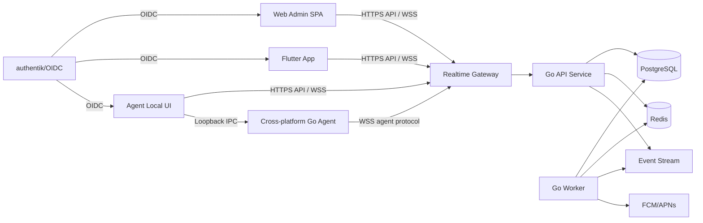
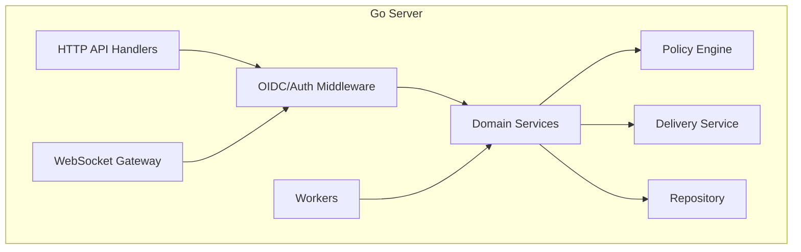
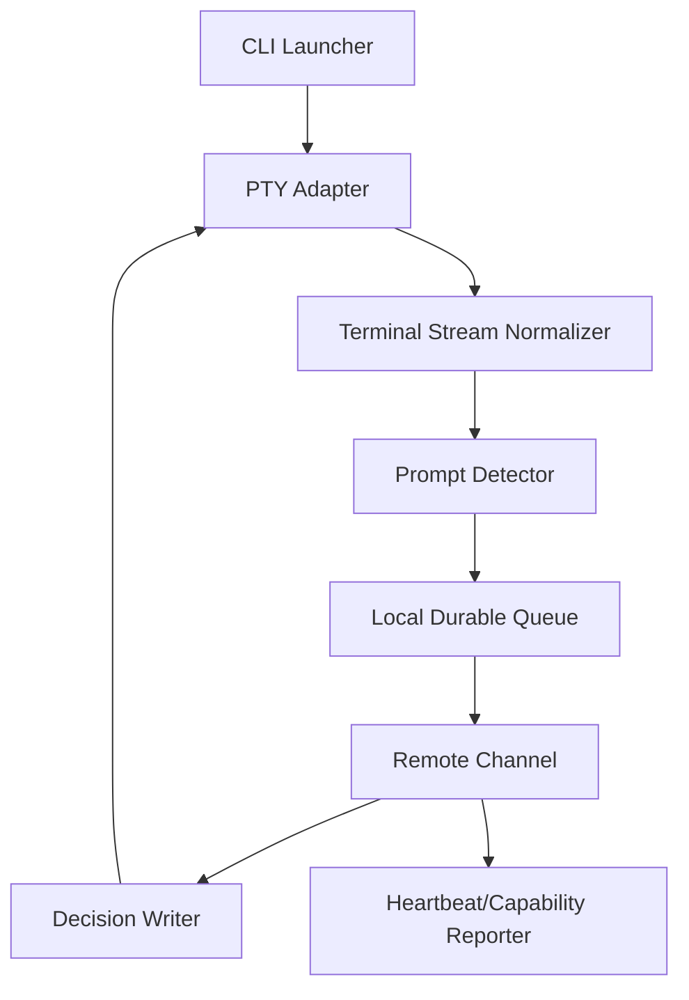

# 系统架构设计

## 1. 总体架构



MVP 可以用一个 Go 二进制启动 `api`、`gateway`、`worker` 三个模块。代码边界按模块划分，部署边界后续可以拆分。

## 2. 服务边界

### 2.1 API Service

职责：

- OIDC Token 校验和本地用户同步。
- 租户、成员、角色、设备、会话、审批、策略、审计的 HTTP API。
- 审批状态机写入 PostgreSQL。
- 生成待通知、待投递、待超时事件。
- 向 Web、移动端、Agent 本地 UI 提供查询接口。

API Service 只处理业务事务，不长期持有 Agent 连接。

### 2.2 Realtime Gateway

职责：

- 维护 Agent、Web、Mobile、Agent Local UI 的 WebSocket 长连接。
- 认证连接身份，并绑定 `tenant_id`、`user_id`、`device_id`。
- 接收 Agent 上报事件，转交 API Service 或内部业务层。
- 将审批决策、策略更新、会话状态变化路由到目标连接。
- 维护在线状态和连接索引。

Gateway 的连接状态存 Redis：

- `presence:device:{device_id}`: 当前连接实例、最后心跳时间、协议版本。
- `presence:user:{user_id}`: 用户在线客户端实例集合。
- `presence:client:{client_instance_id}`: Web、Mobile、Agent Local UI 在线状态。
- `route:device:{device_id}`: 目标 Gateway 实例 ID。

### 2.3 Worker

职责：

- 审批超时扫描。
- 待投递审批决策重试。
- Push 通知发送。
- 审计日志异步补充。
- 输出片段归档和清理。
- 设备离线检测。

Worker 必须按任务类型使用分布式锁，避免多实例重复处理同一批数据。

### 2.4 Web Admin SPA

职责：

- 登录后通过 OIDC 获取 Access Token。
- 调用 API 查询设备、会话、审批、策略和审计。
- 使用 WebSocket 接收实时审批提醒和状态变化。
- 不保存长期敏感令牌，刷新策略由 OIDC 配置决定。

### 2.5 Mobile App

职责：

- 使用 OIDC 登录。
- 注册移动端客户端实例和 Push Token。
- 查看用户有权限的设备、Agent 在线状态、会话列表、会话详情和审批历史。
- 接收审批 Push 和 WebSocket 实时通知。
- 提交审批动作，并在其他端处理后同步最终状态。

移动端不直接连接 Agent，所有数据都通过服务端查询。

### 2.6 Agent Local UI

职责：

- 作为 Agent 所在机器的本地客户端实例。
- 支持用户登录，用于设备绑定和本地审批动作归属。
- 展示本机设备状态、当前 AI CLI 会话、待审批消息和远程处理结果。
- 提交审批动作时调用服务端 API，不能绕过服务端直接修改审批状态。

Agent Local UI 与 Agent 进程可以通过本地 loopback 或进程内 IPC 通信，但审批业务状态仍以服务端为准。

### 2.7 Cross-platform Agent

职责：

- 注册设备并保存设备令牌。
- 启动或托管本地 AI CLI。
- 使用 PTY 抽象接管输入输出。
- 基于适配器识别审批提示。
- 上报审批事件、输出摘要和会话状态。
- 接收审批决策并回写到 CLI。
- 本地持久化未上报事件和未确认投递结果。

Agent 不允许直接连接 Web 或移动端。

## 3. 模块分层



建议代码包：

- `cmd/server`: 进程入口。
- `internal/httpapi`: REST API。
- `internal/realtime`: WebSocket 协议和连接管理。
- `internal/domain`: 核心业务服务和状态机。
- `internal/policy`: 策略匹配。
- `internal/repository`: PostgreSQL 访问。
- `internal/events`: Redis Streams/NATS 适配。
- `internal/jobs`: 后台任务。
- `internal/audit`: 审计事件构造。
- `pkg/protocol`: Agent/WebSocket 消息结构和版本常量。

## 4. Agent 架构



平台适配：

- Windows: ConPTY，处理 PowerShell、cmd、Git Bash、WSL 启动差异。
- macOS/Linux: POSIX PTY，继承用户 shell、环境变量和工作目录。

Agent 进程模型：

- MVP 使用用户态前台/托盘进程运行 CLI 会话。
- Windows Service 只做可选守护和自启动，不直接在 Session 0 启动交互式 CLI。
- 每个 CLI 会话由独立 Session Host 管理，避免一个会话崩溃影响全部会话。

## 5. 通信模式

### 5.1 Agent 到 Server

- 协议: WebSocket over TLS。
- 认证: `device_id + device_token` 换取短期连接票据，或直接使用设备 JWT。
- 心跳: Agent 每 15 秒发送 `agent.heartbeat`，Gateway 45 秒未收到则标记为疑似离线。
- 上报: 审批事件必须携带 `event_id`、`idempotency_key`、`session_id`、`sequence_no`、`protocol_version`。

### 5.2 Web/Mobile 到 Server

- 协议: HTTPS API + WebSocket。
- 认证: OIDC Access Token。
- 审批动作: 必须带 `Idempotency-Key` 请求头，服务端保证重复提交返回相同结果。

### 5.3 Server 到 Agent

- 在线设备: Gateway 直接推送 `approval.decision.deliver`。
- 离线设备: 写入 `approval_deliveries` 待投递表，Agent 重连后拉取。
- 投递结果: Agent 回 `approval.decision.ack`，包含回写状态、终端写入结果和错误码。

## 6. 扩展架构

百万级用户或大量长连接时，拆分为：

```text
edge-gateway        TLS、限流、静态资源
api-service         HTTP API、业务事务
realtime-gateway    Agent/Web/Mobile 长连接
delivery-worker     决策投递、重试
push-worker         FCM/APNs
audit-worker        审计落库、归档
policy-worker       策略编译和缓存
```

扩展原则：

- API 无状态，按 CPU 和请求量水平扩展。
- Gateway 有连接状态，按 `device_id` 或一致性哈希路由。
- Worker 按任务队列分组扩展。
- PostgreSQL 按租户、时间和热点表做分区。
- Redis 只保存短期状态，不作为最终事实来源。

## 7. 关键设计决策

### 7.1 为什么服务端使用 Go

- 同时适合 API、WebSocket Gateway、后台 Worker 和跨平台 Agent。
- 单文件部署和容器化简单。
- 长连接资源占用低，便于后续 Gateway 独立扩容。
- 与跨平台 Agent 共享协议结构和序列化逻辑更方便。

### 7.2 为什么 Web 管理端独立

- 后续审批中心、会话时间线、策略编辑器、审计筛选会比较复杂。
- 前端可以独立发布和缓存，不绑定服务端模板。
- Web 与移动端复用同一套 API 和实时协议。

### 7.3 为什么 Push 不能作为可靠链路

FCM/APNs 只保证尽力提醒，可能延迟、丢失或被系统限制。审批状态必须以 PostgreSQL 为准，WebSocket 和 HTTP API 负责可靠查询与提交。
