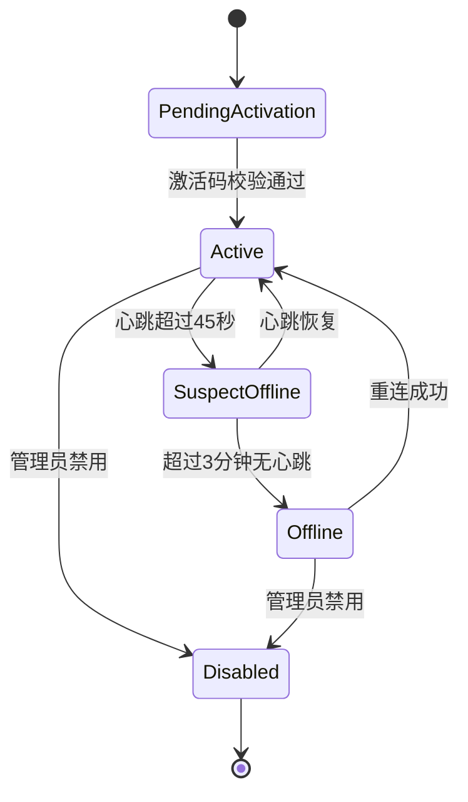
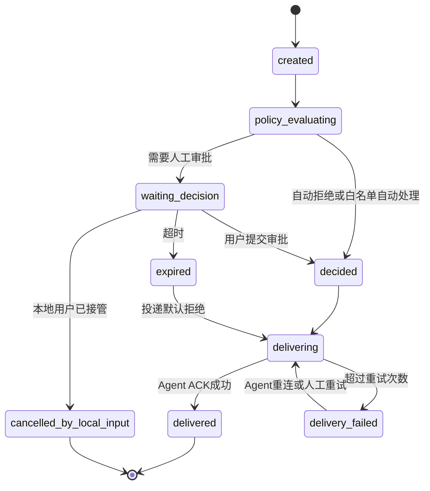

# 模块详细设计

## 1. 服务端详细设计

### 1.1 认证与租户模块

职责：

- 校验 OIDC Access Token。
- 根据 `sub` 同步本地用户。
- 维护租户、成员、角色和权限。
- 提供当前用户可访问租户列表。

关键接口：

- `GET /api/v1/me`
- `GET /api/v1/tenants`
- `GET /api/v1/tenants/{tenant_id}/members`
- `POST /api/v1/tenants/{tenant_id}/members`
- `PATCH /api/v1/tenants/{tenant_id}/members/{member_id}`

权限模型：

- `owner`: 租户所有权限。
- `admin`: 用户、设备、策略、审计管理。
- `approver`: 查看并处理审批。
- `viewer`: 只读查看设备、会话、审批和审计。

### 1.2 设备管理模块

职责：

- 创建设备激活码。
- 接收 Agent 注册请求。
- 绑定设备与租户、用户。
- 管理设备状态、版本、平台、能力集。
- 轮换和吊销设备令牌。
- 管理设备访问授权，支持一个用户绑定多台机器，一台机器授权给多个用户。

关键接口：

- `POST /api/v1/tenants/{tenant_id}/device-activation-codes`
- `GET /api/v1/tenants/{tenant_id}/devices`
- `GET /api/v1/devices/{device_id}`
- `POST /api/v1/devices/{device_id}/disable`
- `POST /api/v1/devices/{device_id}/rotate-token`
- `GET /api/v1/devices/{device_id}/grants`
- `POST /api/v1/devices/{device_id}/grants`
- `DELETE /api/v1/devices/{device_id}/grants/{grant_id}`
- `POST /api/v1/agent/register`

设备状态：

设备令牌要求：

- 服务端只保存 `token_hash`。
- Agent 本地使用系统安全存储保存令牌，Windows 使用 DPAPI，macOS 使用 Keychain，Linux 优先 Secret Service，失败时使用权限收紧的本地文件。
- 令牌轮换后旧令牌保留短暂宽限期，避免正在连接的 Agent 被立即踢掉。

设备授权要求：

- 设备 owner 默认拥有查看和审批权限。
- 租户 admin 默认拥有租户内所有设备权限。
- 普通 approver 必须通过设备授权或租户策略获得处理权限。
- viewer 只能查看设备和会话，不能提交审批决策。

### 1.3 客户端实例模块

职责：

- 记录 Web、移动端、Agent 本地 UI 的登录实例。
- 维护 Push Token、客户端版本、在线状态和最后活跃时间。
- 审批创建后计算需要通知的客户端实例集合。
- 任一端处理审批后，向其他端同步最终状态。

关键接口：

- `POST /api/v1/client-instances`
- `PATCH /api/v1/client-instances/{client_instance_id}`
- `POST /api/v1/client-instances/{client_instance_id}/push-token`
- `POST /api/v1/client-instances/{client_instance_id}/logout`

客户端类型：

- `web`
- `mobile_ios`
- `mobile_android`
- `agent_desktop`

通知规则：

- 所有有权限且在线的客户端实例通过 WebSocket 收到 `approval.created`。
- 移动端离线或后台时额外发送 Push。
- 审批处理成功后，所有相关客户端实例收到 `approval.updated`。
- 客户端收到更新后必须重新拉取审批详情，避免本地状态过期。

### 1.4 会话管理模块

职责：

- 记录 CLI 会话生命周期。
- 保存 CLI 类型、启动参数、工作目录摘要和 Agent 能力。
- 接收会话输出摘要和状态变化。
- 为审批详情提供最近上下文。
- 支持按设备查看该机器全部 AI CLI 会话。
- 支持同一设备并发运行多种 AI CLI。

关键接口：

- `GET /api/v1/tenants/{tenant_id}/sessions`
- `GET /api/v1/devices/{device_id}/sessions`
- `GET /api/v1/sessions/{session_id}`
- `GET /api/v1/sessions/{session_id}/output?before_seq=&limit=`
- `POST /api/v1/agent/sessions`
- `PATCH /api/v1/agent/sessions/{session_id}`

会话状态：

- `starting`
- `running`
- `waiting_approval`
- `completed`
- `failed`
- `closed`
- `lost`

Agent 必须为每个输出片段分配单调递增 `sequence_no`，服务端按 `(session_id, sequence_no)` 去重。

支持的 CLI 类型：

- `codex`
- `claude_code`
- `opencode`
- `copilot`
- `gemini`
- `custom`

### 1.5 审批模块

职责：

- 接收 Agent 上报的审批事件。
- 根据幂等键创建或返回已有审批单。
- 执行策略匹配。
- 通知 Web/Mobile。
- 接收人工决策。
- 接收 Web、移动端、Agent 本地 UI 的审批决策。
- 下发决策到 Agent。
- 记录投递和回写结果。
- 向其他客户端同步处理方、处理方式和处理内容。

审批状态机：

审批决策：

- `approve`: 回写确认输入。
- `reject`: 回写拒绝输入。
- `reply`: 回写用户自定义文本。
- `timeout_reject`: 系统超时拒绝。
- `policy_reject`: 策略自动拒绝。
- `policy_approve`: 显式白名单自动批准。

处理方记录：

- `decided_by_actor_type`: `user`、`device`、`system`、`policy`、`local`。
- `decided_by_actor_id`: 用户 ID、系统任务 ID 或策略 ID。
- `decided_from_client_instance_id`: 提交审批动作的客户端实例。
- `decided_from_client_type`: `web`、`mobile_ios`、`mobile_android`、`agent_desktop`。
- `decision_payload_redacted`: 自定义回复内容的脱敏结果。

并发控制：

- `approval_requests.version` 使用乐观锁。
- 只有 `waiting_decision` 状态允许用户决策。
- 重复 `Idempotency-Key` 返回第一次提交结果。
- 两个用户同时审批时，只有第一个事务成功，另一个返回当前最终状态。

### 1.6 策略模块

职责：

- 匹配租户、用户、设备、CLI 类型、事件类型、风险等级。
- 生成人工审批、自动拒绝或显式白名单自动批准决策。
- 记录策略命中原因。

MVP 支持字段：

- `scope`: `tenant` 或 `user`
- `cli_type`
- `event_type`
- `risk_level`
- `device_ids`
- `command_pattern`
- `decision`
- `priority`
- `enabled`

安全默认值：

- 未命中策略时进入人工审批。
- 高风险事件不允许全局自动批准。
- 自动批准必须配置过期时间和审计备注。

### 1.7 投递模块

职责：

- 为每个审批决策创建 `approval_deliveries`。
- 判断目标设备是否在线。
- 在线时通过 Gateway 推送。
- 离线时等待 Agent 重连。
- 处理 Agent ACK。
- 超过重试次数后标记失败并告警。

投递状态：

- `pending`
- `sent`
- `acked`
- `failed`
- `cancelled`

重试策略：

- 立即尝试 1 次。
- 失败后按 5 秒、15 秒、60 秒、5 分钟退避。
- 审批过期后仍要投递默认拒绝，避免 CLI 无限等待。

### 1.8 审计模块

职责：

- 记录设备注册、登录、会话创建、审批创建、策略命中、审批动作、投递 ACK、异常重试等事件。
- 记录哪些客户端实例收到通知，以及哪个客户端实例完成处理。
- 支持按租户、用户、设备、审批单、时间范围查询。
- 导出 CSV 或 JSONL。

审计事件必须包含：

- `tenant_id`
- `actor_type`
- `actor_id`
- `action`
- `target_type`
- `target_id`
- `result`
- `trace_id`
- `request_id`
- `created_at`

## 2. Agent 详细设计

Agent 接入 AI CLI 的 PTY 托管、终端归一化、CLI Adapter、输入协调和回写细节见 `docs/10-agent-cli-integration.md`。本章节只保留模块级设计。

### 2.1 进程结构

- `agent`: 主进程，负责配置、注册、远程连接、会话管理。
- `session host`: 每个 CLI 会话一个宿主对象或子进程，负责 PTY 生命周期。
- `pty adapter`: 平台 PTY 读写。
- `stream normalizer`: 处理 ANSI、控制字符、屏幕刷新和行缓冲。
- `prompt detector`: 识别审批事件。
- `local store`: SQLite 或嵌入式 KV，保存未确认事件、投递 ACK 和会话元数据。
- `local UI`: 本机交互入口，支持登录、设备绑定、本机会话查看和本地审批。

### 2.2 CLI 启动模式

支持两种模式：

- `managed`: Agent 启动 CLI，完整接管输入输出。
- `attach`：后续预留，接入已有终端会话；MVP 不做。

`managed` 模式必须记录：

- CLI 类型。
- 命令行。
- 工作目录。
- 环境变量白名单摘要。
- Agent 版本。
- PTY 大小。

同一台机器允许多个并发会话。每个会话必须有独立 `session_id`、`cli_type`、PTY、Detector 状态和本地缓冲。

### 2.3 Prompt Detector

识别分三层：

1. 终端归一化层：移除 ANSI 样式，保留必要光标控制语义，形成稳定文本窗口。
2. 通用规则层：识别 `[y/N]`、`yes/no`、`approve/reject`、`continue`、`press enter` 等模式。
3. CLI 适配层：针对 Codex、Claude Code、Gemini CLI 等定义事件类型、风险等级、默认回写文本。

每个识别结果必须包含：

- `event_id`: Agent 本地 UUID。
- `idempotency_key`: `device_id + session_id + detector_name + normalized_prompt_hash + nearest_sequence_no` 计算。
- `event_type`
- `risk_level`
- `prompt_text`
- `context_before`
- `suggested_actions`
- `default_timeout_action`

误识别控制：

- 同一 `idempotency_key` 不重复上报。
- prompt 消失后自动取消本地待上报草稿。
- 用户在本地直接输入后，Agent 上报 `approval.superseded`，服务端取消仍未决审批。

### 2.4 回写设计

Agent 收到决策后：

1. 校验 `approval_id`、`session_id`、`decision_id` 是否已处理。
2. 确认会话仍在 `running` 或 `waiting_approval`。
3. 根据 CLI 适配器生成回写字节，例如 `y\r`、`n\r`、自定义文本加回车。
4. 写入 PTY。
5. 等待短时间输出变化，判断是否成功解除等待。
6. 上报 ACK。

ACK 结果：

- `written`: 已写入 PTY。
- `accepted`: 输出变化表明 CLI 已继续。
- `session_closed`: 会话已结束。
- `write_failed`: 写入失败。
- `stale_decision`: 决策已过期或重复。

### 2.5 Agent 本地 UI 审批

Agent 本地 UI 可以处理审批，但必须遵守服务端状态机：

1. 本地 UI 使用用户身份登录。
2. 本地 UI 通过服务端 API 拉取审批详情。
3. 本地 UI 调用 `POST /api/v1/approvals/{id}/decision` 提交动作。
4. 服务端记录客户端实例和用户身份。
5. 服务端再把决策投递给 Agent 设备通道。
6. Agent 设备通道执行 PTY 回写并 ACK。

Agent 本地 UI 不能直接把审批标记为完成，也不能绕过服务端直接写回远程审批结果。

## 3. Web 管理端详细设计

### 3.1 页面

- 登录回调页。
- 审批收件箱。
- 审批详情。
- 设备列表和设备详情。
- 按设备查看会话列表和会话详情。
- 策略列表和策略编辑。
- 审计日志。
- 系统设置。

### 3.2 审批详情内容

- 设备名称、平台、Agent 版本。
- CLI 类型和会话状态。
- 风险等级、事件类型、策略命中结果。
- 原始提示文本和脱敏后的上下文。
- 可选动作：批准、拒绝、自定义回复。
- 倒计时、最终状态、投递状态、回写结果。
- 处理方用户、客户端类型、处理时间和处理内容。

### 3.3 实时体验

- WebSocket 接收 `approval.created`、`approval.updated`、`device.status_changed`。
- 页面刷新后必须从 API 拉取最终状态，不能只依赖 WebSocket 缓存。
- 审批按钮提交后进入 pending 状态，直到 API 返回最终业务状态。

## 4. 移动端详细设计

### 4.1 功能页面

- 登录页。
- 审批列表。
- 审批详情。
- 设备列表。
- 设备详情。
- 某台设备上的会话列表。
- 会话详情。
- 设备状态。
- 个人设置。

移动端会话查看：

- 通过 `GET /api/v1/devices/{device_id}/sessions` 查看指定机器所有 AI CLI 会话。
- 通过 `GET /api/v1/sessions/{session_id}` 查看会话详情。
- 通过 `GET /api/v1/sessions/{session_id}/approvals` 查看会话关联审批。
- 默认只展示脱敏后的启动命令、最近输出摘要和审批上下文。

### 4.2 推送策略

- 高风险审批: 高优先级推送。
- 普通审批: 标准推送。
- 设备离线/恢复: 状态推送。

Push Payload 只包含：

- `approval_id`
- `tenant_id`
- `risk_level`
- `event_type`

不在推送里放完整 prompt 或终端输出。

## 5. 异常处理

- Agent 心跳超时: 先 `suspect_offline`，再 `offline`，避免短暂网络抖动造成误报。
- 审批超时: 写入系统拒绝决策并投递到 Agent。
- 决策投递失败: 保留 `approval_deliveries`，等待重连或人工重试。
- Push 失败: 记录失败，不影响审批单状态。
- 输出入库失败: 会话继续，记录降级审计。
- 策略服务异常: 默认进入人工审批。
