# 关键流程设计

## 1. 用户登录流程

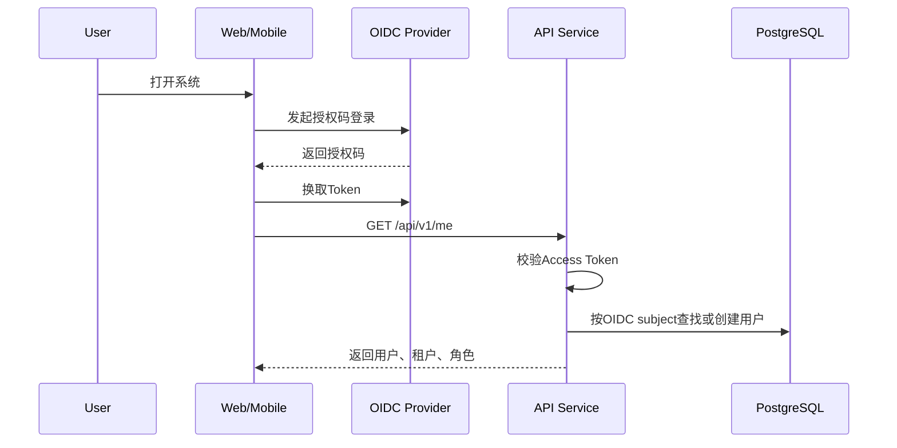

要点：

- 服务端不保存 OIDC 密码。
- 本地用户以 OIDC `issuer + subject` 唯一标识。
- 角色以本地租户成员关系为准，不直接信任前端传入。

## 2. 设备激活流程

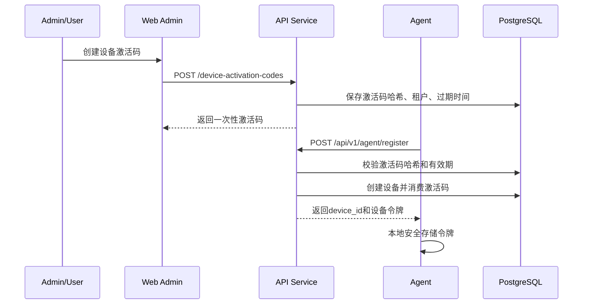

约束：

- 激活码只显示一次。
- 激活码默认 10 分钟过期。
- 同一激活码只能成功消费一次。
- 注册请求需要包含 Agent 平台、版本、主机名摘要和能力集。

## 3. Agent 本地登录绑定流程

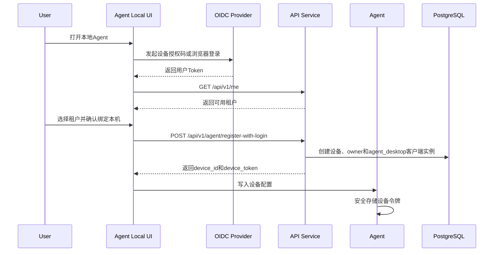

要点：

- Agent 本地 UI 的用户登录身份只用于绑定和提交本地审批动作。
- Agent 设备令牌仍是机器身份，用于长连接和回写 ACK。
- 服务端必须能区分“谁绑定了设备”和“哪台设备在回写”。

## 4. Agent 建立长连接流程

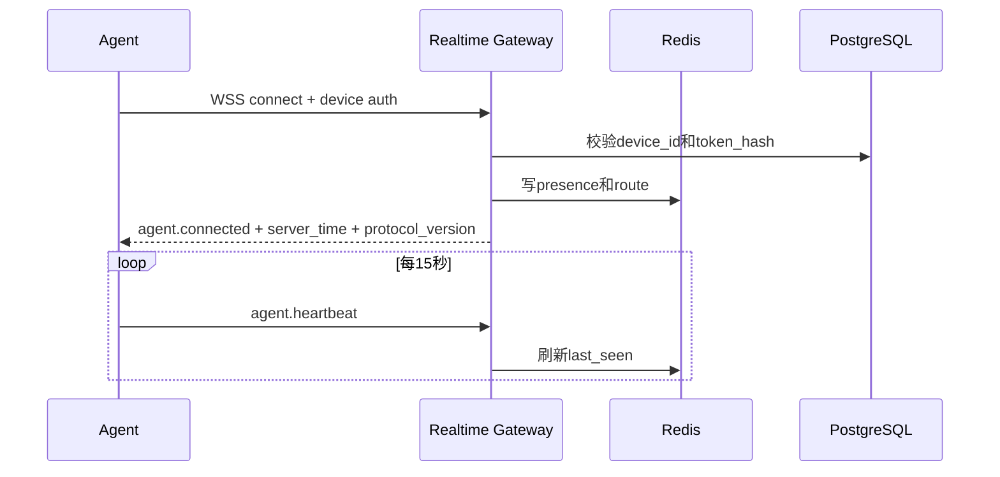

要点：

- Gateway 支持协议版本协商。
- Agent 心跳携带当前会话数量、队列积压数、最近错误码。
- Gateway 不把 Redis presence 当作最终事实，设备状态仍落 PostgreSQL。

## 5. CLI 会话启动流程

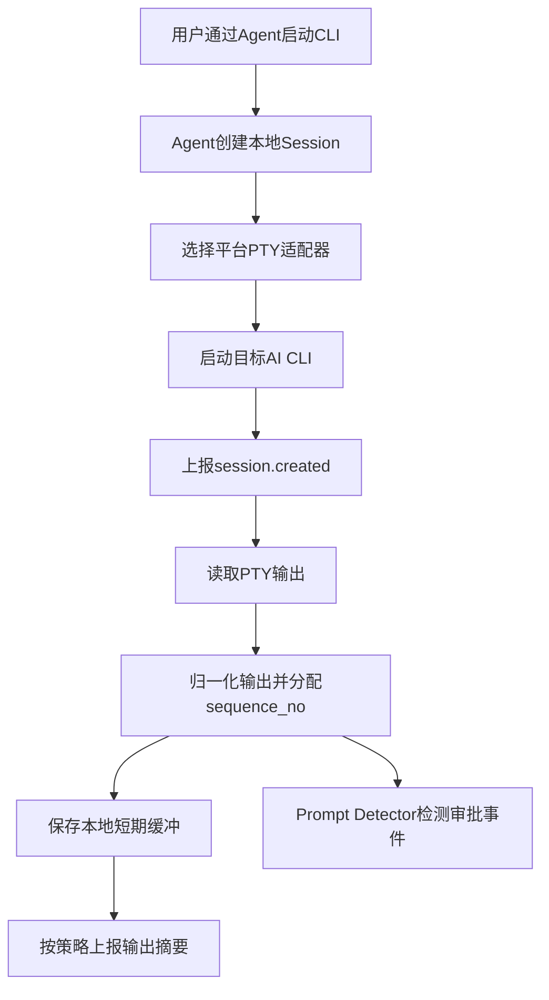

要点：

- Agent 不默认上传完整终端输出，只上传审批相关上下文和必要摘要。
- 如果用户启用会话回放，输出片段必须先脱敏再入库。
- 会话结束时 Agent 上报退出码、结束原因和最后输出摘要。
- 同一设备允许同时启动多个 CLI 会话，每个会话独立上报状态和审批事件。
- 移动端通过服务端按设备查看这些会话，不直接连接 Agent。

## 6. 审批创建流程

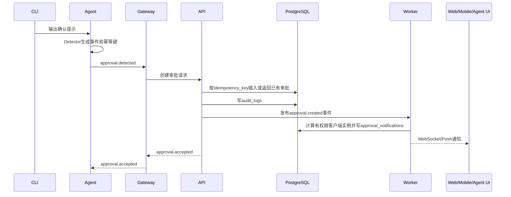

要点：

- `idempotency_key` 在同一租户内唯一。
- 重复上报返回已有 `approval_id`。
- 服务端创建审批后立即进入策略评估。
- 通知发送给所有有权限的客户端实例，包括多台手机、Web 页面和 Agent 本地 UI。

## 7. 策略评估流程

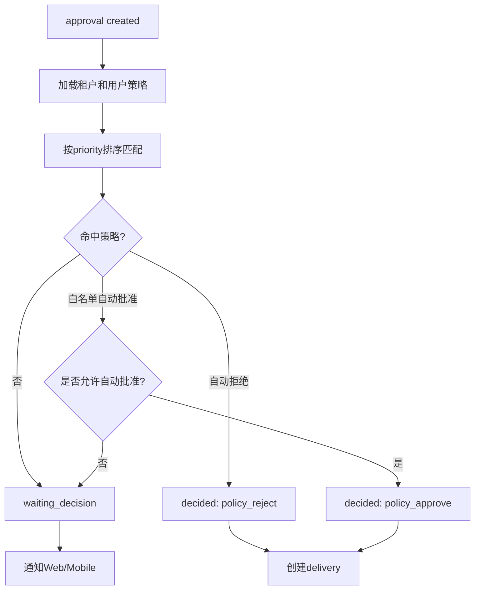

要点：

- 高风险事件默认不能被全局自动批准。
- 策略命中结果写入审批记录和审计日志。
- 策略服务异常时默认进入人工审批。

## 8. 多端人工审批与同步流程

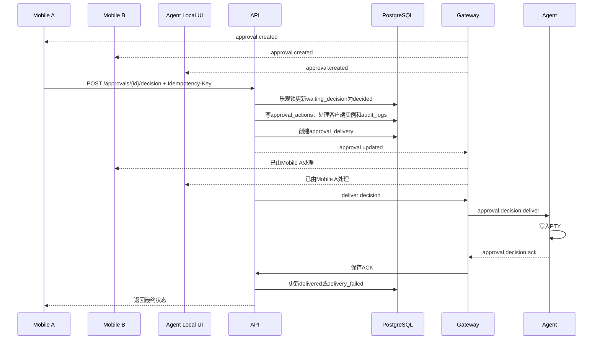

并发规则：

- 第一个成功提交的审批动作生效。
- 后续提交返回 409 或当前最终状态。
- 相同 `Idempotency-Key` 重试返回第一次结果。
- 同步消息必须包含处理方用户、客户端类型、处理动作和处理时间。
- 其他端收到同步消息后从 API 拉取审批详情，展示“已由其他端处理”。

## 9. Agent 本地 UI 审批流程

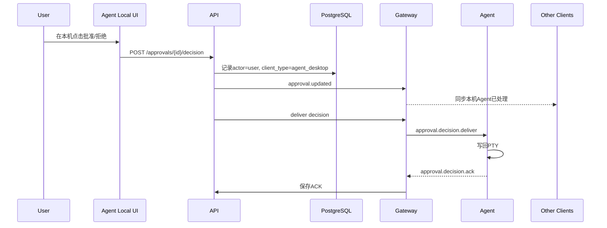

要点：

- Agent 本地 UI 提交审批动作时使用用户身份。
- Agent 回写 ACK 使用设备身份。
- 审计必须同时保存用户、客户端实例、设备和会话。

## 10. 审批超时流程

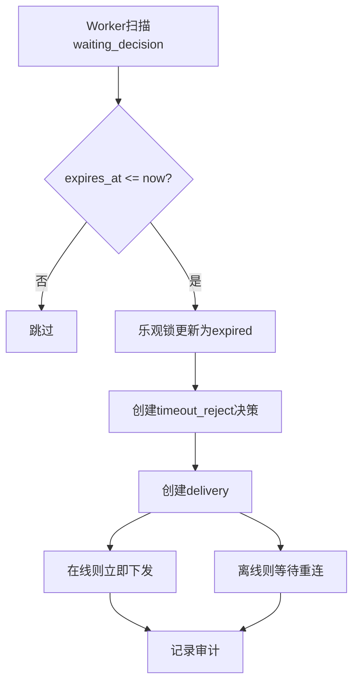

要点：

- 超时不是简单关闭审批，而是生成默认拒绝决策。
- 默认拒绝仍需投递给 Agent，避免 CLI 长时间阻塞。

## 11. Agent 断线恢复流程

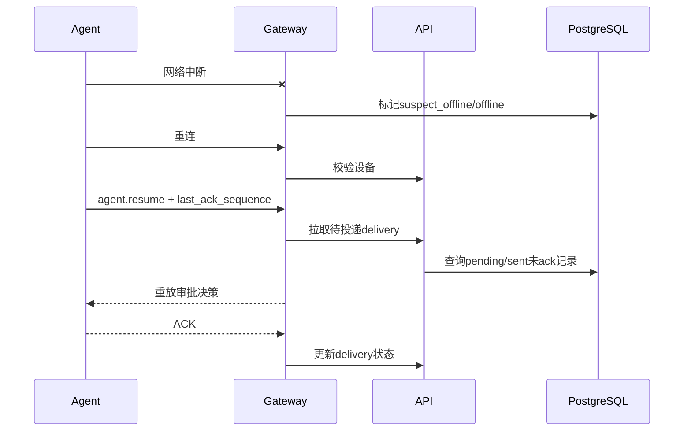

要点：

- Agent 本地队列补发未确认的 `approval.detected`。
- 服务端按幂等键去重。
- 对已决审批，Agent 重复 ACK 不改变最终状态，只更新最后确认时间。

## 12. 本地人工接管流程

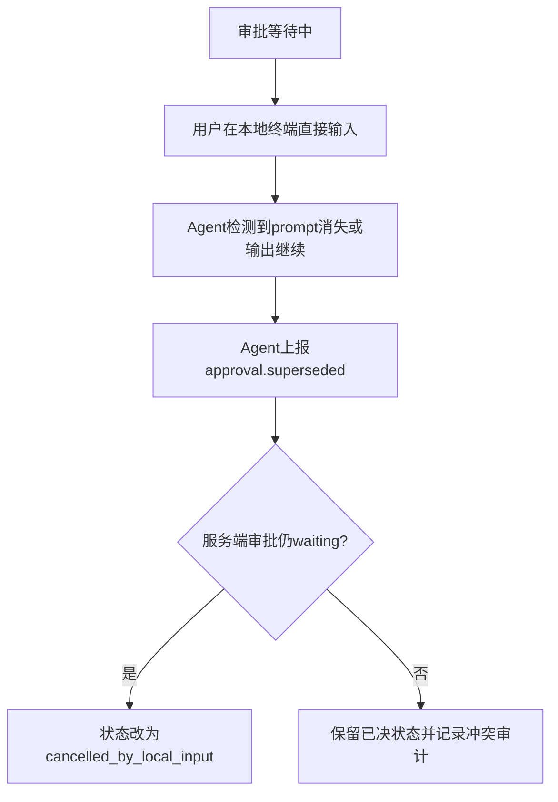

要点：

- 本地用户永远可以接管本机 CLI。
- 远程审批系统不能阻止本地输入。
- 发生冲突时以已经写入 CLI 的实际结果和审计记录为准。

## 13. 移动端查看设备会话流程

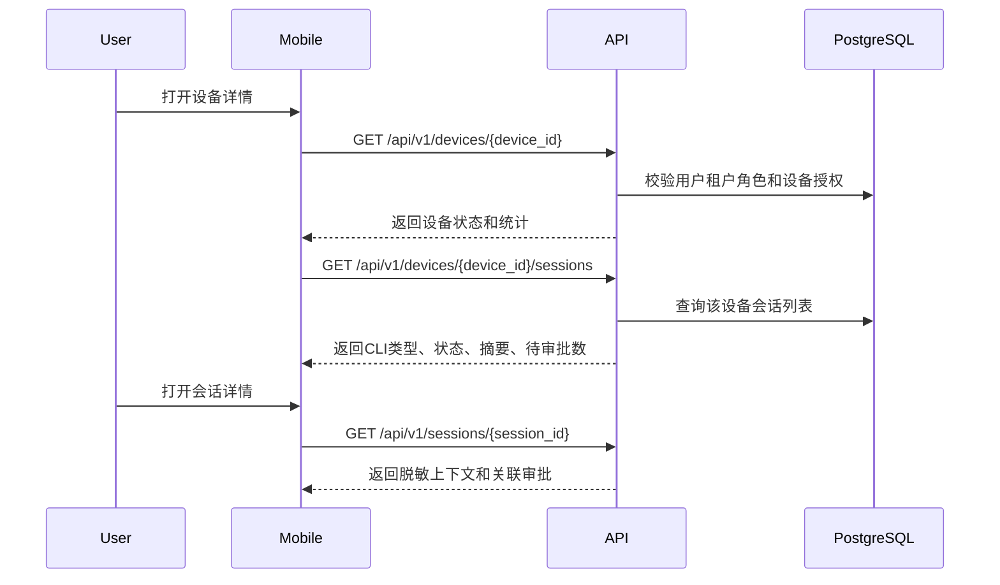

要点：

- 移动端只通过服务端查询，不直连 Agent。
- 查询权限由租户角色和设备授权共同决定。
- 默认返回脱敏后的命令、输出摘要和审批上下文。

## 14. 管理员禁用设备流程

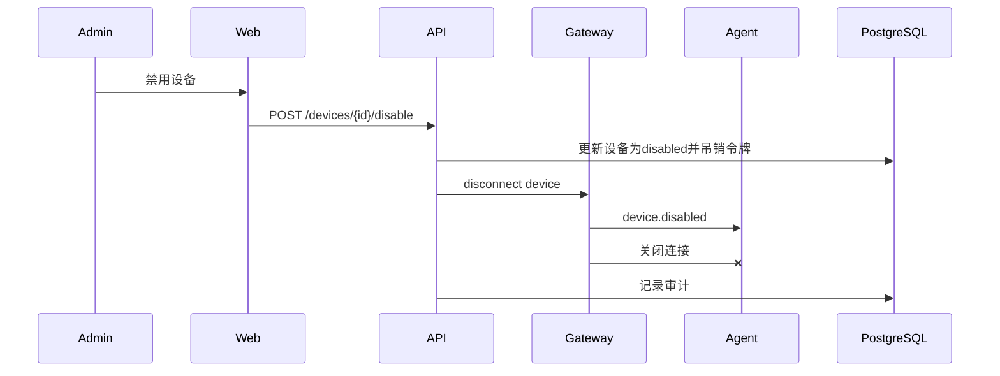

禁用后：

- 新连接被拒绝。
- 未投递审批标记为 `cancelled` 或由管理员选择超时拒绝。
- Agent 本地提示设备已被禁用。
