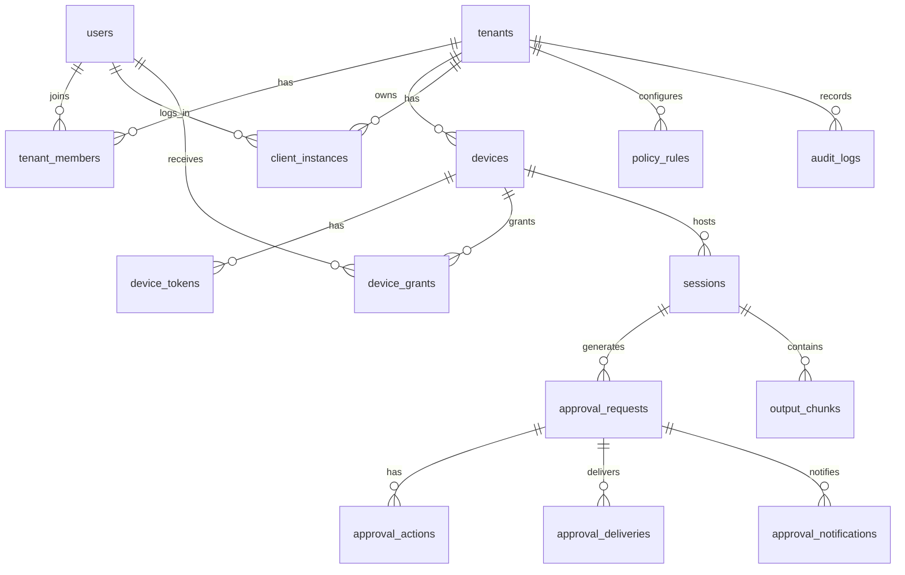

# 数据模型设计

## 1. 设计原则

- 所有业务表优先使用 `uuid` 主键。
- 多租户业务表必须包含 `tenant_id`。
- 重要状态流转使用乐观锁 `version`。
- 幂等请求必须有唯一键。
- 设备令牌、激活码只保存哈希。
- 大表按时间或租户分区预留设计。
- 审批、审计、投递记录不物理删除。

## 2. 枚举约定

### 2.1 device_status

- `pending_activation`
- `active`
- `suspect_offline`
- `offline`
- `disabled`

### 2.2 session_status

- `starting`
- `running`
- `waiting_approval`
- `completed`
- `failed`
- `closed`
- `lost`

### 2.3 approval_status

- `created`
- `policy_evaluating`
- `waiting_decision`
- `decided`
- `expired`
- `delivering`
- `delivered`
- `delivery_failed`
- `cancelled_by_local_input`

### 2.4 decision_type

- `approve`
- `reject`
- `reply`
- `timeout_reject`
- `policy_reject`
- `policy_approve`

### 2.5 delivery_status

- `pending`
- `sent`
- `acked`
- `failed`
- `cancelled`

### 2.6 client_type

- `web`
- `mobile_ios`
- `mobile_android`
- `agent_desktop`

### 2.7 notification_status

- `pending`
- `sent`
- `failed`
- `read`

### 2.8 cli_type

- `codex`
- `claude_code`
- `opencode`
- `copilot`
- `gemini`
- `custom`

### 2.9 risk_level

- `low`
- `medium`
- `high`
- `critical`

### 2.10 actor_type

- `user`
- `device`
- `system`
- `policy`
- `local`

### 2.11 ack_result

- `written`
- `accepted`
- `session_closed`
- `write_failed`
- `stale_decision`

### 2.12 tenant_member_role

- `owner`
- `admin`
- `approver`
- `viewer`

### 2.13 device_grant_permission

- `view`
- `approve`
- `admin`

### 2.14 client_instance_status

- `active`
- `logged_out`
- `revoked`

### 2.15 common_active_status

- `active`
- `disabled`

适用范围：

- `tenants.status`
- `users.status`
- `tenant_members.status`

### 2.16 device_token_status

- `active`
- `rotated`
- `revoked`

### 2.17 platform

- `windows`
- `macos`
- `linux`
- `ios`
- `android`
- `browser`

### 2.18 arch

- `amd64`
- `arm64`

### 2.19 push_provider

- `fcm`
- `apns`
- `webpush`

### 2.20 notification_channel

- `websocket`
- `push`

### 2.21 output_stream_type

- `stdout`
- `stderr`
- `terminal`

### 2.22 policy_decision

- `manual`
- `auto_reject`
- `auto_approve`

### 2.23 action_result

- `accepted`
- `duplicate`
- `conflict`

### 2.24 audit_result

- `success`
- `failure`
- `conflict`

## 3. 核心实体

### 3.1 tenants

| 字段 | 类型 | 说明 |
|---|---|---|
| id | uuid | 主键 |
| name | varchar(128) | 租户名称 |
| slug | varchar(128) | 租户短名，全局唯一 |
| status | varchar(32) | common_active_status |
| created_at | timestamptz | 创建时间 |
| updated_at | timestamptz | 更新时间 |

约束：

- `unique(slug)`

### 3.2 users

| 字段 | 类型 | 说明 |
|---|---|---|
| id | uuid | 主键 |
| oidc_issuer | varchar(256) | OIDC issuer |
| oidc_subject | varchar(256) | OIDC subject |
| email | varchar(256) | 邮箱 |
| display_name | varchar(128) | 显示名 |
| status | varchar(32) | common_active_status |
| last_login_at | timestamptz | 最近登录时间 |
| created_at | timestamptz | 创建时间 |
| updated_at | timestamptz | 更新时间 |

约束：

- `unique(oidc_issuer, oidc_subject)`
- `unique(email)` 可选，取决于 OIDC 是否保证邮箱唯一。

### 3.3 tenant_members

| 字段 | 类型 | 说明 |
|---|---|---|
| id | uuid | 主键 |
| tenant_id | uuid | 租户 |
| user_id | uuid | 用户 |
| role | varchar(32) | tenant_member_role |
| status | varchar(32) | common_active_status |
| created_at | timestamptz | 创建时间 |
| updated_at | timestamptz | 更新时间 |

约束：

- `unique(tenant_id, user_id)`
- 外键 `tenant_id -> tenants(id)`
- 外键 `user_id -> users(id)`

### 3.4 device_activation_codes

| 字段 | 类型 | 说明 |
|---|---|---|
| id | uuid | 主键 |
| tenant_id | uuid | 租户 |
| created_by_user_id | uuid | 创建人 |
| code_hash | varchar(128) | 激活码哈希 |
| expires_at | timestamptz | 过期时间 |
| consumed_at | timestamptz | 消费时间 |
| consumed_by_device_id | uuid | 消费设备 |
| created_at | timestamptz | 创建时间 |

约束：

- `unique(code_hash)`
- `consumed_at is null` 时才允许消费。

### 3.5 client_instances

| 字段 | 类型 | 说明 |
|---|---|---|
| id | uuid | 主键 |
| tenant_id | uuid | 租户 |
| user_id | uuid | 登录用户 |
| client_type | varchar(32) | client_type |
| device_id | uuid | Agent 本地 UI 所属设备，可为空 |
| display_name | varchar(128) | 客户端显示名 |
| app_version | varchar(64) | 客户端版本 |
| platform | varchar(64) | platform |
| push_token_ciphertext | text | 加密后的 Push Token，可为空 |
| push_provider | varchar(32) | push_provider，可为空 |
| status | varchar(32) | client_instance_status |
| last_seen_at | timestamptz | 最近活跃时间 |
| created_at | timestamptz | 创建时间 |
| updated_at | timestamptz | 更新时间 |

约束：

- `device_id` 只在 `client_type = 'agent_desktop'` 时必填。
- Push Token 明文不入库，使用服务端密钥加密后保存。

索引：

- `client_instances(tenant_id, user_id, status)`
- `client_instances(device_id, status)`

### 3.6 devices

| 字段 | 类型 | 说明 |
|---|---|---|
| id | uuid | 主键 |
| tenant_id | uuid | 租户 |
| owner_user_id | uuid | 设备所属用户 |
| name | varchar(128) | 设备名称 |
| platform | varchar(32) | platform |
| arch | varchar(32) | arch |
| agent_version | varchar(64) | Agent 版本 |
| protocol_version | varchar(32) | 协议版本 |
| capabilities | jsonb | 能力集 |
| status | varchar(32) | device_status |
| last_seen_at | timestamptz | 最近心跳 |
| disabled_at | timestamptz | 禁用时间 |
| created_at | timestamptz | 创建时间 |
| updated_at | timestamptz | 更新时间 |
| version | bigint | 乐观锁版本 |

索引：

- `devices(tenant_id, status)`
- `devices(owner_user_id, status)`
- `devices(last_seen_at)`

### 3.7 device_grants

| 字段 | 类型 | 说明 |
|---|---|---|
| id | uuid | 主键 |
| tenant_id | uuid | 租户 |
| device_id | uuid | 设备 |
| user_id | uuid | 被授权用户 |
| permission | varchar(32) | device_grant_permission |
| granted_by_user_id | uuid | 授权人 |
| created_at | timestamptz | 创建时间 |
| expires_at | timestamptz | 过期时间，可为空 |
| revoked_at | timestamptz | 吊销时间 |

约束：

- `unique(device_id, user_id, permission)` 在未吊销时唯一。

索引：

- `device_grants(tenant_id, user_id)`
- `device_grants(device_id, revoked_at)`

### 3.8 device_tokens

| 字段 | 类型 | 说明 |
|---|---|---|
| id | uuid | 主键 |
| device_id | uuid | 设备 |
| token_hash | varchar(128) | 设备令牌哈希 |
| status | varchar(32) | device_token_status |
| created_at | timestamptz | 创建时间 |
| expires_at | timestamptz | 过期时间 |
| revoked_at | timestamptz | 吊销时间 |

约束：

- 同一设备只能有有限数量 active/rotated 宽限令牌。
- 服务端绝不保存明文 token。

### 3.9 sessions

| 字段 | 类型 | 说明 |
|---|---|---|
| id | uuid | 主键 |
| tenant_id | uuid | 租户 |
| device_id | uuid | 所属设备 |
| user_id | uuid | 发起用户，可为空 |
| cli_type | varchar(64) | cli_type |
| command_line_redacted | text | 脱敏后的启动命令 |
| working_dir_hash | varchar(128) | 工作目录哈希 |
| status | varchar(32) | session_status |
| started_at | timestamptz | 启动时间 |
| ended_at | timestamptz | 结束时间 |
| exit_code | integer | 退出码 |
| last_sequence_no | bigint | 最近输出序号 |
| last_output_summary | text | 最近输出摘要 |
| created_at | timestamptz | 创建时间 |
| updated_at | timestamptz | 更新时间 |
| version | bigint | 乐观锁版本 |

索引：

- `sessions(tenant_id, status, started_at desc)`
- `sessions(device_id, status, started_at desc)`
- `sessions(device_id, cli_type, started_at desc)`

### 3.10 approval_requests

| 字段 | 类型 | 说明 |
|---|---|---|
| id | uuid | 主键 |
| tenant_id | uuid | 租户 |
| device_id | uuid | 设备 |
| session_id | uuid | 会话 |
| event_id | varchar(128) | Agent 本地事件 ID |
| idempotency_key | varchar(256) | 上报幂等键 |
| event_type | varchar(64) | 事件类型 |
| risk_level | varchar(32) | risk_level |
| prompt_text_redacted | text | 脱敏后的提示文本 |
| context_before_redacted | text | 脱敏后的上下文 |
| suggested_actions | jsonb | 建议动作 |
| default_timeout_action | varchar(32) | 默认超时动作 |
| status | varchar(32) | approval_status |
| policy_result | jsonb | 策略命中结果 |
| expires_at | timestamptz | 过期时间 |
| decided_at | timestamptz | 决策时间 |
| decided_by_actor_type | varchar(32) | actor_type |
| decided_by_actor_id | varchar(64) | 决策主体 |
| decided_from_client_instance_id | uuid | 提交决策的客户端实例 |
| decided_from_client_type | varchar(32) | client_type |
| decision_type | varchar(32) | decision_type |
| decision_payload_redacted | text | 脱敏后的回复内容 |
| created_at | timestamptz | 创建时间 |
| updated_at | timestamptz | 更新时间 |
| version | bigint | 乐观锁版本 |

约束：

- `unique(tenant_id, idempotency_key)`
- `event_id` 不作为全局唯一，只用于 Agent 本地追踪。

索引：

- `approval_requests(tenant_id, status, created_at desc)`
- `approval_requests(device_id, status, created_at desc)`
- `approval_requests(session_id, created_at desc)`
- `approval_requests(expires_at) where status = 'waiting_decision'`

### 3.11 approval_actions

| 字段 | 类型 | 说明 |
|---|---|---|
| id | uuid | 主键 |
| tenant_id | uuid | 租户 |
| approval_request_id | uuid | 审批单 |
| actor_type | varchar(32) | actor_type |
| actor_id | varchar(64) | 行为主体 |
| client_instance_id | uuid | 提交动作的客户端实例 |
| client_type | varchar(32) | client_type |
| decision_type | varchar(32) | decision_type |
| payload_redacted | text | 脱敏后的动作内容 |
| idempotency_key | varchar(256) | 用户动作幂等键 |
| result | varchar(32) | action_result |
| created_at | timestamptz | 创建时间 |

约束：

- `unique(tenant_id, approval_request_id, idempotency_key)` 当幂等键非空。

### 3.12 approval_deliveries

| 字段 | 类型 | 说明 |
|---|---|---|
| id | uuid | 主键 |
| tenant_id | uuid | 租户 |
| approval_request_id | uuid | 审批单 |
| device_id | uuid | 目标设备 |
| decision_type | varchar(32) | decision_type |
| payload_redacted | text | 回写内容 |
| status | varchar(32) | delivery_status |
| attempt_count | integer | 尝试次数 |
| next_attempt_at | timestamptz | 下次尝试时间 |
| sent_at | timestamptz | 发送时间 |
| acked_at | timestamptz | ACK时间 |
| ack_result | varchar(64) | ack_result |
| ack_detail | jsonb | ACK详情 |
| last_error | text | 最近错误 |
| created_at | timestamptz | 创建时间 |
| updated_at | timestamptz | 更新时间 |
| version | bigint | 乐观锁版本 |

索引：

- `approval_deliveries(device_id, status, next_attempt_at)`
- `approval_deliveries(tenant_id, status, created_at desc)`

### 3.13 approval_notifications

| 字段 | 类型 | 说明 |
|---|---|---|
| id | uuid | 主键 |
| tenant_id | uuid | 租户 |
| approval_request_id | uuid | 审批单 |
| client_instance_id | uuid | 目标客户端实例 |
| user_id | uuid | 目标用户 |
| client_type | varchar(32) | client_type |
| channel | varchar(32) | notification_channel |
| status | varchar(32) | notification_status |
| sent_at | timestamptz | 发送时间 |
| read_at | timestamptz | 已读时间 |
| failed_at | timestamptz | 失败时间 |
| error | text | 错误信息 |
| created_at | timestamptz | 创建时间 |

用途：

- 追踪哪些客户端实例收到审批提醒。
- 支持排查多手机、多浏览器、Agent 本地 UI 的同步问题。
- 不作为审批状态事实来源。

索引：

- `approval_notifications(approval_request_id, client_instance_id)`
- `approval_notifications(tenant_id, user_id, created_at desc)`

### 3.14 output_chunks

| 字段 | 类型 | 说明 |
|---|---|---|
| id | bigserial | 主键 |
| tenant_id | uuid | 租户 |
| session_id | uuid | 会话 |
| sequence_no | bigint | 输出序号 |
| stream_type | varchar(16) | output_stream_type |
| content_redacted | text | 脱敏后内容 |
| content_hash | varchar(128) | 原始内容哈希 |
| created_at | timestamptz | 创建时间 |

约束：

- `unique(session_id, sequence_no)`

索引：

- `output_chunks(session_id, sequence_no desc)`
- 建议按 `created_at` 月分区。

### 3.15 policy_rules

| 字段 | 类型 | 说明 |
|---|---|---|
| id | uuid | 主键 |
| tenant_id | uuid | 租户 |
| owner_user_id | uuid | 用户级策略，可为空 |
| name | varchar(128) | 策略名称 |
| priority | integer | 优先级，数字越小越先匹配 |
| cli_type | varchar(64) | cli_type，可为空表示全部 |
| event_type | varchar(64) | 事件类型，可为空表示全部 |
| risk_level | varchar(32) | risk_level，可为空表示全部 |
| device_selector | jsonb | 设备匹配规则 |
| command_pattern | varchar(512) | 命令匹配模式 |
| decision | varchar(32) | policy_decision |
| expires_at | timestamptz | 策略过期时间 |
| enabled | boolean | 是否启用 |
| reason | text | 审计备注 |
| created_by_user_id | uuid | 创建人 |
| created_at | timestamptz | 创建时间 |
| updated_at | timestamptz | 更新时间 |

索引：

- `policy_rules(tenant_id, enabled, priority)`
- `policy_rules(owner_user_id, enabled, priority)`

### 3.16 audit_logs

| 字段 | 类型 | 说明 |
|---|---|---|
| id | bigserial | 主键 |
| tenant_id | uuid | 租户 |
| actor_type | varchar(32) | actor_type |
| actor_id | varchar(64) | 行为主体 |
| action | varchar(128) | 行为名称 |
| target_type | varchar(64) | 目标类型 |
| target_id | varchar(64) | 目标 ID |
| result | varchar(32) | audit_result |
| trace_id | varchar(64) | 链路 ID |
| request_id | varchar(64) | 请求 ID |
| detail | jsonb | 扩展内容 |
| created_at | timestamptz | 创建时间 |

索引：

- `audit_logs(tenant_id, created_at desc)`
- `audit_logs(trace_id)`
- `audit_logs(target_type, target_id)`
- 建议按 `created_at` 月分区。

## 4. 关系说明

## 5. 分区和保留策略

- `audit_logs`: 至少保留 180 天，企业租户可配置更长保留期。
- `output_chunks`: 默认保留 7 到 30 天，支持关闭完整输出入库。
- `approval_requests`: 不物理删除，长期归档。
- `approval_deliveries`: 保留时间不短于审批记录。
- 大规模部署时 `approval_requests`、`audit_logs`、`output_chunks` 按月分区。

## 6. 迁移要求

- 使用 Go 迁移工具，例如 `golang-migrate` 或 `atlas`。
- 每次迁移必须可回滚，涉及大表变更时采用分阶段迁移。
- 所有状态枚举先用 `varchar + check constraint`，避免 PostgreSQL enum 后续变更困难。
