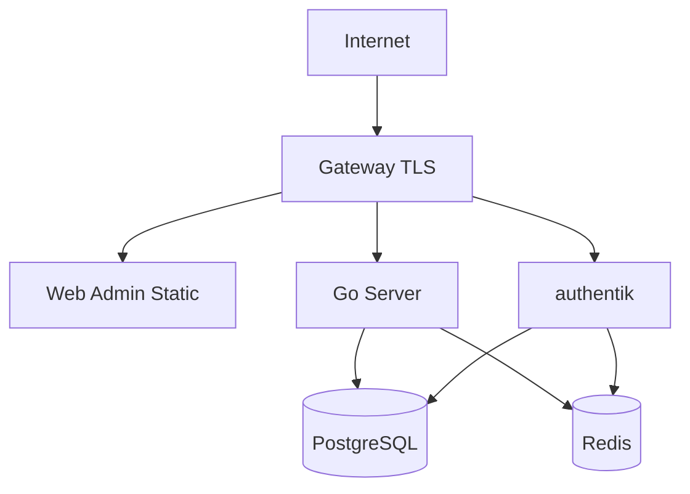

# 部署设计

## 1. 部署目标

服务端必须支持从单机 Docker Compose 平滑演进到多实例部署。MVP 以一个 Go 服务进程承载 API、Realtime Gateway、Worker 三个模块；规模化后拆为多个部署单元。

## 2. MVP Docker 组件

- `gateway`: Traefik 或 Nginx，负责 TLS、反向代理、静态前端资源。
- `server`: Go 服务端，启动 API、WebSocket Gateway、Worker。
- `web-admin`: 独立前端构建产物，可由 gateway 或静态服务托管。
- `postgres`: PostgreSQL。
- `redis`: Redis。
- `authentik-server`: OIDC 认证服务。
- `authentik-worker`: authentik 异步任务。
- `push-worker`: MVP 可内置在 `server`，后续拆分。

可选组件：

- `minio`: 保存导出文件或大附件。
- `prometheus`
- `grafana`
- `jaeger` 或 OTLP Collector。

## 3. 建议目录结构

```text
server/
  cmd/server/
  internal/
  pkg/protocol/
web-admin/
  src/
  package.json
agent/
  cmd/agent/
  internal/
deploy/
  docker-compose.yml
  .env.example
  gateway/
  postgres/
  authentik/
docs/
```

## 4. Docker Compose 拓扑



## 5. 环境变量

### 5.1 Server

- `APP_ENV`
- `APP_PUBLIC_URL`
- `HTTP_ADDR`
- `WS_ADDR`
- `DATABASE_URL`
- `REDIS_ADDR`
- `REDIS_PASSWORD`
- `OIDC_ISSUER`
- `OIDC_CLIENT_ID`
- `OIDC_AUDIENCE`
- `OIDC_JWKS_CACHE_TTL`
- `DEVICE_TOKEN_PEPPER`
- `ACTIVATION_CODE_PEPPER`
- `ENCRYPTION_KEY`
- `PUSH_FCM_CREDENTIALS_PATH`
- `PUSH_APNS_KEY_PATH`
- `OUTPUT_RETENTION_DAYS`
- `AUDIT_RETENTION_DAYS`
- `LOG_LEVEL`
- `OTEL_EXPORTER_OTLP_ENDPOINT`

要求：

- `.env` 不提交仓库。
- 提供 `.env.example`，只包含示例值。
- `DEVICE_TOKEN_PEPPER`、`ACTIVATION_CODE_PEPPER`、`ENCRYPTION_KEY` 必须来自密钥管理系统或部署环境变量。

### 5.2 Web Admin

- `VITE_API_BASE_URL`
- `VITE_WS_BASE_URL`
- `VITE_OIDC_ISSUER`
- `VITE_OIDC_CLIENT_ID`

前端环境变量不能包含服务端密钥。

### 5.3 PostgreSQL

- `POSTGRES_DB`
- `POSTGRES_USER`
- `POSTGRES_PASSWORD`

### 5.4 authentik

- `AUTHENTIK_SECRET_KEY`
- `AUTHENTIK_POSTGRESQL__HOST`
- `AUTHENTIK_POSTGRESQL__USER`
- `AUTHENTIK_POSTGRESQL__NAME`
- `AUTHENTIK_POSTGRESQL__PASSWORD`
- `AUTHENTIK_REDIS__HOST`

## 6. 健康检查

Server 暴露：

- `GET /health/live`: 进程存活。
- `GET /health/ready`: 数据库、Redis、OIDC JWKS 可用。
- `GET /metrics`: Prometheus 指标。

Gateway 需要对 WebSocket upgrade 放行，并配置空闲超时大于 Agent 心跳周期。

## 7. 日志和指标

日志字段：

- `timestamp`
- `level`
- `service`
- `instance_id`
- `tenant_id`
- `user_id`
- `device_id`
- `session_id`
- `approval_id`
- `trace_id`
- `request_id`

核心指标：

- HTTP 请求量、延迟、错误率。
- WebSocket 在线连接数。
- Agent 心跳延迟。
- 审批创建数量。
- 待审批数量。
- 审批超时数量。
- 投递成功率和失败率。
- Worker 队列积压。
- PostgreSQL 查询延迟。
- Redis 操作延迟。

## 8. 扩容方案

### 8.1 单体部署

适用：

- MVP。
- 小团队或个人用户。
- 连接数较少。

形式：

```text
server --enable-api --enable-gateway --enable-worker
```

### 8.2 拆分部署

适用：

- 多租户。
- 长连接数量增长。
- Worker 任务影响 API 延迟。

形式：

```text
api-service         --enable-api
realtime-gateway    --enable-gateway
delivery-worker     --worker=delivery
push-worker         --worker=push
audit-worker        --worker=audit
```

### 8.3 百万级规模预留

- Gateway 按连接数水平扩容。
- 使用一致性哈希或 Redis route 表定位设备连接。
- 事件总线从 Redis Streams 迁移到 NATS JetStream 或 Kafka。
- PostgreSQL 读写分离和分区表。
- 审计和输出归档进入对象存储或数据仓库。
- 对 WebSocket 消息按租户限流。

## 9. Kubernetes 部署建议

生产环境可拆为：

- `Deployment/api-service`
- `Deployment/realtime-gateway`
- `Deployment/delivery-worker`
- `Deployment/push-worker`
- `Deployment/web-admin`
- `StatefulSet/postgres` 或使用托管数据库。
- `StatefulSet/redis` 或使用托管 Redis。

建议：

- API 和 Worker 使用滚动发布。
- Gateway 发布时启用连接排空。
- 数据库迁移作为单独 Job 执行。
- Secret 使用 Kubernetes Secret 或外部 Secret Manager。
- HPA 基于 CPU、请求延迟、连接数、队列积压。

## 10. Agent 发布

Agent 需要按平台分发：

- Windows: `.msi` 或 `.exe`，支持用户态安装。
- macOS: `.pkg` 或签名后的二进制。
- Linux: `.deb`、`.rpm` 和 tarball。

Agent 更新要求：

- 版本号遵循语义化版本。
- 上报当前版本和协议版本。
- 服务端可提示升级，但默认不强制中断会话。
- 升级前等待当前 CLI 会话结束，除非用户手动确认。

## 11. 备份和恢复

- PostgreSQL 每日全量备份，关键部署增加 WAL 归档。
- Redis 不作为最终数据源，可以不做长期备份。
- `.env` 和密钥材料必须独立备份。
- 恢复演练至少覆盖：用户、设备、审批、审计、策略。
