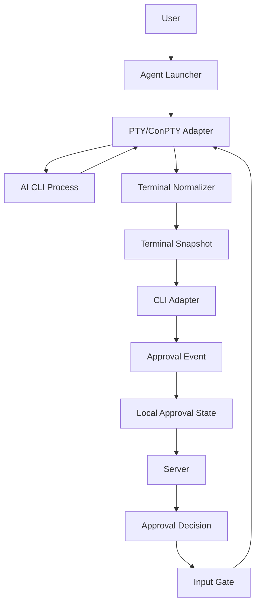
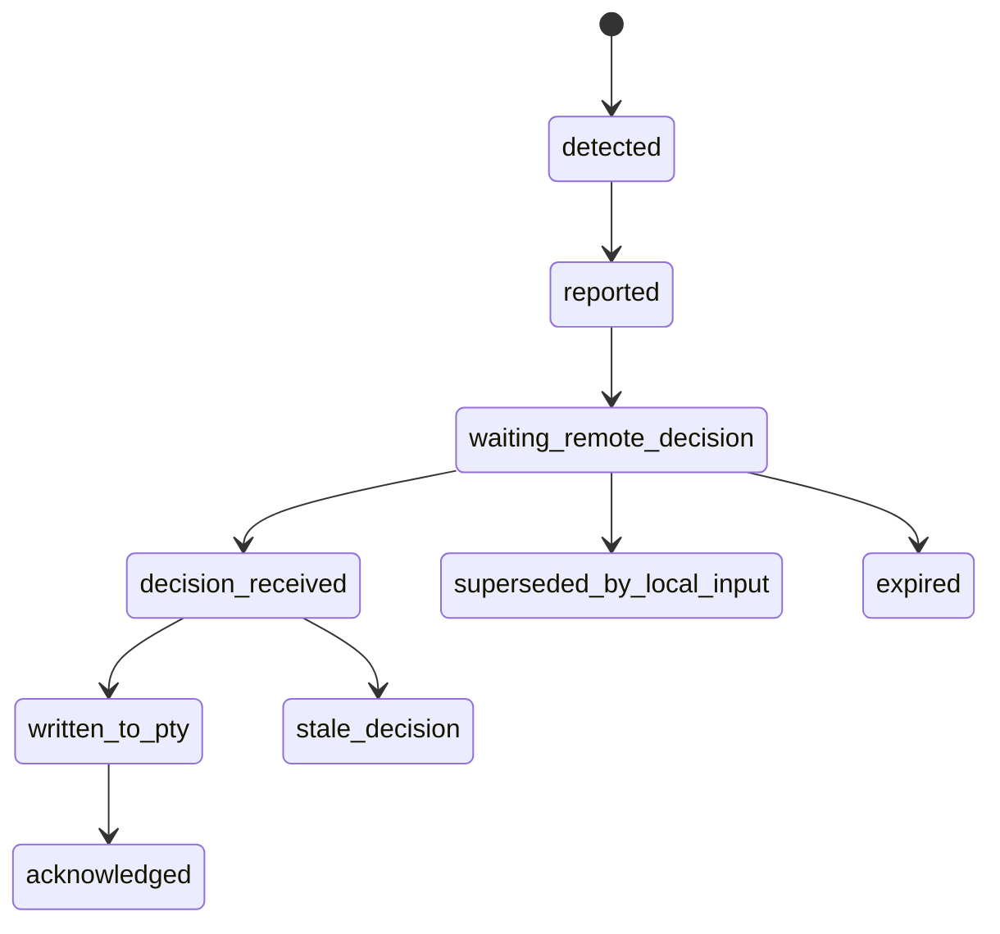

# Agent CLI 接入设计

## 1. 设计定位

Agent 不通过进程注入、全局键盘监听、网络代理或读取 CLI 私有存储来接入 AI CLI。第一版采用更可控的方式：

```text
Agent 启动并托管 AI CLI
Agent 创建 PTY/ConPTY
AI CLI 在 PTY 中运行
Agent 读取终端输出
Agent 识别审批提示
服务端完成审批状态流转
Agent 将审批结果写回 PTY
```

Agent 的本质是 **PTY 托管器 + CLI 适配器运行时**，不是对任意外部终端的透明拦截器。

## 2. MVP 接入方式

第一版只支持由 Agent 启动或托管的 CLI 会话：

```bash
aicli run -- codex
aicli run -- claude
aicli run -- opencode
aicli run -- gh copilot
aicli run -- gemini
```

也可以提供快捷别名：

```bash
aicli codex
aicli claude
aicli opencode
aicli copilot
aicli gemini
```

MVP 不支持：

- attach 到已经存在的终端会话。
- hook 其他终端窗口。
- 注入到 AI CLI 进程。
- 全局键盘监听。
- 代理 AI CLI 网络请求。
- 读取 AI CLI 的私有数据库、缓存或内部状态文件。

这些能力跨平台稳定性差、权限要求高、风险边界模糊，后续只有在明确场景和权限模型后再评估。

## 3. Agent 运行管线



每个 CLI 会话独立拥有：

- `session_id`
- `cli_type`
- 目标进程。
- PTY 实例。
- Terminal Normalizer。
- CLI Adapter。
- 本地审批状态。
- 本地消息队列。

## 4. Launcher 层

职责：

- 解析 `aicli run -- <command>`。
- 创建会话 ID。
- 选择 CLI 类型。
- 创建 PTY。
- 启动目标 CLI 进程。
- 继承必要的用户环境。
- 上报 `session.created`。

记录信息：

- `cli_type`
- 脱敏后的命令行。
- 工作目录哈希。
- 进程 ID。
- PTY 尺寸。
- Agent 版本。
- 协议版本。

CLI 类型识别：

- 根据命令名识别：`codex`、`claude`、`opencode`、`gh copilot`、`gemini`。
- 用户也可以显式指定：`aicli run --cli-type custom -- my-tool`。

## 5. PTY 层

平台实现：

- Windows: ConPTY。
- macOS/Linux: POSIX PTY。

PTY 层职责：

- 启动目标 CLI。
- 读取终端输出字节流。
- 写入用户输入或远程审批决策。
- 处理窗口大小变化。
- 监听进程退出。

PTY 输出不是普通日志，包含：

- ANSI 样式。
- 光标移动。
- 屏幕清理。
- 局部重绘。
- 输入回显。
- 多行菜单。

因此后续识别不能直接基于原始字节流做简单正则。

## 6. Terminal Normalizer

Normalizer 负责把终端字节流变成稳定的文本快照。

职责：

- 解析 ANSI/VT 控制序列。
- 维护虚拟屏幕 buffer。
- 保留最近 N 行文本。
- 生成当前可见屏幕。
- 生成光标附近文本窗口。
- 分配单调递增 `sequence_no`。
- 标记输出是否发生明显变化。
- 对文本做第一层脱敏。

输出结构：

```go
type TerminalSnapshot struct {
    SessionID       string
    SequenceNo      int64
    VisibleText     string
    CursorLine      string
    RecentLines     []string
    StableTextHash  string
    CapturedAt      time.Time
    Truncated       bool
}
```

Adapter 只能读取 `TerminalSnapshot`，不要直接读取原始 PTY 字节。

## 7. CLI Adapter 契约

每个 AI CLI 一个适配器。适配器负责把终端快照转换为结构化审批事件，并把审批决策转换为终端输入。

建议接口：

```go
type CLIAdapter interface {
    Type() CLIType
    Detect(snapshot TerminalSnapshot) []DetectedEvent
    BuildDecisionInput(event ApprovalEvent, decision Decision) ([]byte, error)
    IsPromptStillActive(snapshot TerminalSnapshot, event ApprovalEvent) bool
}
```

`Detect` 负责：

- 判断当前快照是否出现审批提示。
- 识别事件类型。
- 判断风险等级。
- 提取提示文本和上下文。
- 给出建议动作。
- 给出默认超时动作。

`BuildDecisionInput` 负责：

- 将 `approve` 转为对应 CLI 的确认输入。
- 将 `reject` 转为对应 CLI 的拒绝输入。
- 将 `reply` 转为自定义文本输入。

`IsPromptStillActive` 负责：

- 判断远程决策到达时，原 prompt 是否仍然存在。
- 防止本地用户已经处理后重复写入。

## 8. 内置适配器

MVP 建议内置：

- `codex`
- `claude_code`
- `opencode`
- `copilot`
- `gemini`
- `custom`

`custom` 适配器只支持配置化规则，不保证复杂 TUI 场景。

每个适配器至少定义：

- 命令识别规则。
- 审批 prompt 识别规则。
- 风险等级判断。
- 支持动作。
- 默认回写输入。
- prompt 是否仍然活跃的判断逻辑。

## 9. 配置化规则

简单 CLI 可以通过配置补充规则：

```yaml
cli_type: custom
command_names:
  - my-ai-cli
prompt_patterns:
  - name: permission_request
    event_type: permission_request
    risk_level: high
    contains:
      - "approve"
      - "permission"
    actions:
      approve: "y\r"
      reject: "n\r"
    default_timeout_action: reject
```

限制：

- 配置规则只能处理简单文本 prompt。
- 对复杂 TUI、动态菜单、光标重绘，必须写代码适配器。
- 配置规则必须经过本地测试后才能启用。

## 10. 审批事件生成

Agent 检测到 prompt 后生成结构化事件：

```json
{
  "session_id": "uuid",
  "cli_type": "codex",
  "event_id": "agent-local-uuid",
  "idempotency_key": "sha256:...",
  "sequence_no": 123,
  "event_type": "permission_request",
  "risk_level": "high",
  "prompt_text": "redacted prompt",
  "context_before": "redacted context",
  "suggested_actions": ["approve", "reject"],
  "default_timeout_action": "reject"
}
```

`idempotency_key` 建议由以下内容计算：

```text
device_id
session_id
cli_type
adapter_name
normalized_prompt_hash
nearest_sequence_no
```

要求：

- 同一 prompt 屏幕刷新不能重复创建审批。
- prompt 消失后，不再继续等待远程决策。
- 重复上报时服务端返回已有审批单。

## 11. Agent 本地审批状态

Agent 本地需要维护审批状态，避免重复上报和重复写入。



状态含义：

- `detected`: 本地识别到 prompt。
- `reported`: 已上报服务端。
- `waiting_remote_decision`: 等待用户从任意端处理。
- `decision_received`: 收到服务端投递决策。
- `written_to_pty`: 已写入 PTY。
- `acknowledged`: 已向服务端 ACK。
- `superseded_by_local_input`: 本地用户已直接操作终端。
- `expired`: 审批已超时。
- `stale_decision`: 决策到达时 prompt 已不存在。

## 12. Input Gate

Input Gate 负责协调本地输入和远程审批写入。

规则：

- 非审批等待状态，本地键盘输入直接写入 PTY。
- 检测到审批 prompt 后，进入 `approval_pending`。
- 本地用户先输入时，Agent 上报 `approval.superseded`。
- 远程决策先到时，Agent 写入适配器生成的输入。
- 写入前必须调用 `IsPromptStillActive`。
- 如果 prompt 已消失，返回 `stale_decision`，不再写入。

Input Gate 不应该阻止用户本地强行输入。系统只记录接管结果和冲突审计。

## 13. 决策回写

回写流程：

1. 收到 `approval.decision.deliver`。
2. 校验 `delivery_id`、`approval_id`、`session_id`。
3. 检查本地是否已经处理过。
4. 获取最新 `TerminalSnapshot`。
5. 调用 `IsPromptStillActive`。
6. 调用 `BuildDecisionInput`。
7. 写入 PTY。
8. 观察短时间输出变化。
9. 上报 `approval.decision.ack`。

ACK 结果：

- `written`: 字节已写入 PTY。
- `accepted`: CLI 输出变化表明已继续执行。
- `stale_decision`: prompt 已不存在。
- `write_failed`: PTY 写入失败。
- `session_closed`: 会话已结束。

服务端根据 ACK 更新投递状态，但不回滚已形成的审批决策。

## 14. 误识别和漏识别处理

误识别处理：

- 通过幂等键避免重复审批。
- prompt 消失后自动标记本地事件失效。
- 用户本地接管时上报 `approval.superseded`。
- 服务端记录冲突审计。

漏识别处理：

- 本地终端仍可继续人工操作。
- Agent UI 可以允许用户手动标记当前会话需要远程确认，作为后续增强。
- 每个适配器需要有样本回归测试。

## 15. 适配器测试要求

每个内置适配器需要准备样本：

- 普通输出。
- 权限审批 prompt。
- 拒绝 prompt。
- 多行菜单。
- ANSI 彩色输出。
- 屏幕重绘输出。
- prompt 重复刷新。
- 本地输入后 prompt 消失。

测试目标：

- 正确识别审批事件。
- 不重复生成事件。
- 正确判断 prompt 是否仍然活跃。
- 正确生成批准、拒绝、自定义回复的输入字节。
